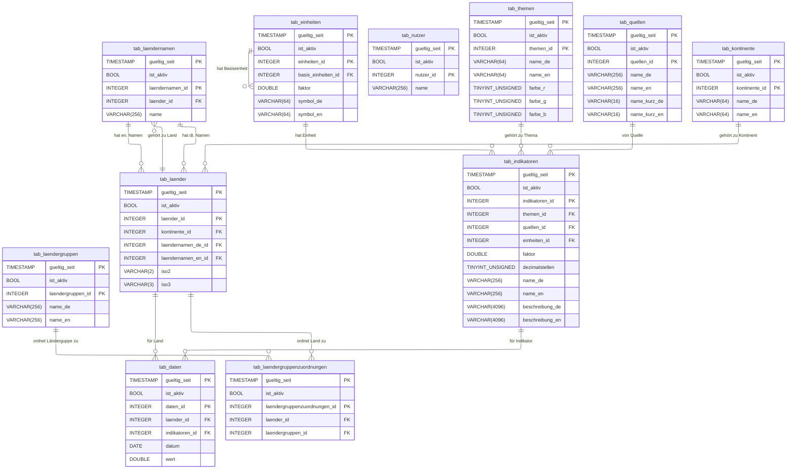
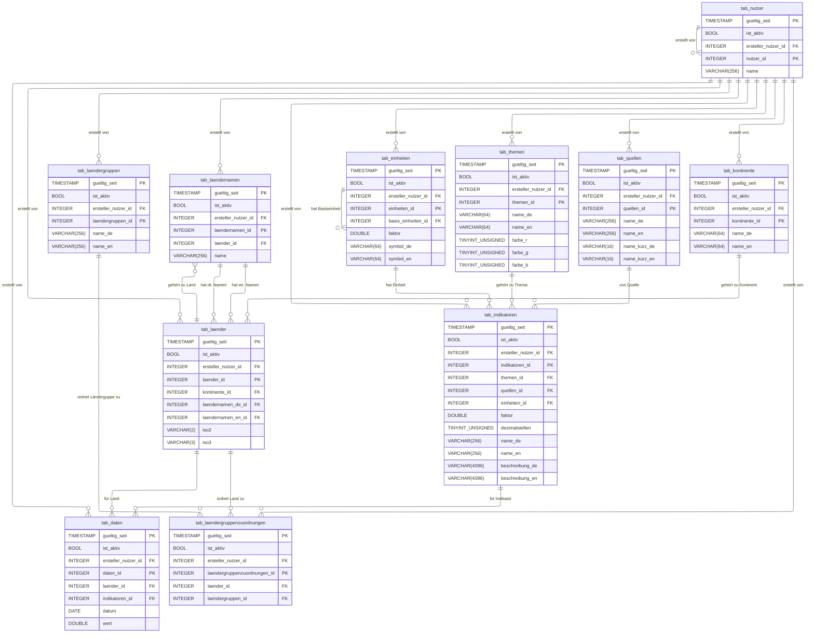

# Dokumentation für das INTSTAT Redesign

## Nutzertracking

Bisher haben wir uns alle mit dem selben Benutzernamen mit der Intstat verbunden. Dies können wir so beibehalten. Es gibt jedoch auch die Möglichkeit, aus Gründen der Nachvollziehbarkeit, zu tracken, welcher Benutzer welche Änderungen vorgenommen hat. Dazu wären folgende Schritte notwendig:

1. Erstellen eines Accounts für **jeden** Nutzer der Intstat.
2. Erstellen einer Tabelle `nutzer`.
3. Verweis auf die Tabelle `nutzer` in **jeder** Zeile **jeder** Tabelle mittels `ersteller_nutzer_id`.

## Versionierung

MySQL unterstützt keine automatische Versionierung, wie es z.B. MariaDB mit `WITH SYSTEM VERSIONING` tut. Mithilfe von zusätzlichen Spalten, _Views_, _SQL-Triggers_ und _Stored Procedures_ kann eine solche Versionierung jedoch manuell implementiert werden.

Jede Tabelle enthält dazu zwei weitere Spalten:

1. `gueltig_seit`: Speichert das Datum, an welchem die Zeile hinzugefügt wurde. Existiert keine weitere Zeile mit der gleichen `id` und einem späteren Datum in `gueltig_seit`, so ist die Zeile die aktuell gültige Zeile.

2. `ist_aktiv`: Enthält diese Spalte den Wert `FALSE` oder `0`, so zeigt das einen Löschvorgang an. Ist eine Zeile mit `ist_aktiv = FALSE` die aktuelle Zeile, so bedeutet das, das es keine aktuell gültige Version dieser Zeile gibt. Eine solche Zeile wird als _Tombstone_ oder _Grabstein_ bezeichnet.

SQL-Befehle wie `UPDATE` oder `DELETE` sind nicht erlaubt. Nur `INSERT` kann ausgeführt werden. Das wird über entsprechende _Trigger_ sichergestellt. 

Zur Vereinfachung erfolgt die schreibende Interaktion mit der Datenbank ausschließlich über _Stored Procedures_. Die Lesende Interaktion kann über die Tabelle direkt erfolgen, ist jedoch einfacher über _Views_. So gibt es bspw. eine View, welche nur die aktuell gültigen zeilen anzeigt.

## Entity Relationship Diagramme

### Ohne Nutzer Tracking



### Mit Nutzer Tracking



## Interaktion mit der Datenbank

### Einfügen einer Zeile (`INSERT`)

```SQL
SET @neue_id = 0;

CALL insert_into_kontinente(
    "atlantis",
    "Atlantis",
    @neue_id
);

SELECT @neue_id;
```

### Auslesen einer aktuell gültigen Zeile (`SELECT`)

#### Aus der Tabelle

```SQL
SELECT t.*
from tab_kontinente t
INNER JOIN (
    SELECT kontinente_id, MAX(gueltig_seit) AS max_gueltig_seit
    FROM tab_kontinente
    GROUP BY kontinente_id
) latest
ON t.kontinente_id = latest.kontinente_id 
AND t.gueltig_seit = latest.max_gueltig_seit
WHERE t.ist_aktiv;
```

#### Aus der View

```SQL
SELECT * from view_kontinente_aktuell;
```

### Aktualisieren einer Zeile (`UPDATE`)

```SQL
CALL update_value_kontinente_name_de(
    atlantis_id,
    'Atlantis'
);
```

### Löschen einer Zeile (`DELETE`)

```SQL
CALL delete_from_kontinente(
    atlantis_id
);
```

### Auslesen einer älteren Version einer Zeile (`SELECT`)

```SQL
SELECT t.*
from tab_kontinente t
INNER JOIN (
    SELECT kontinente_id, MAX(gueltig_seit) AS max_gueltig_seit
    FROM tab_kontinente
    WHERE gueltig_seit <= '2025-12-31 12:00:00'
    GROUP BY kontinente_id
) latest
ON t.kontinente_id = latest.kontinente_id 
AND t.gueltig_seit = latest.max_gueltig_seit
WHERE t.ist_aktiv;
```
