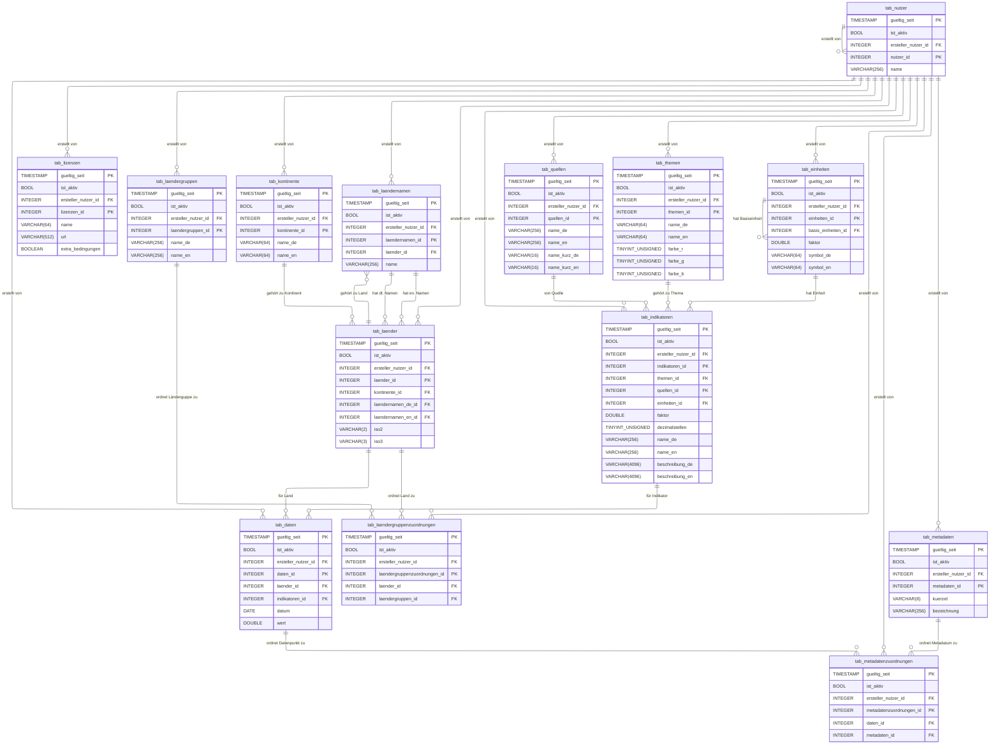

# Dokumantation für das INTSTAT Redesign

## Nutzertracking

Bisher haben wir uns alle mit dem selben Benutzernamen mit der Intstat verbunden. Dies können wir so beibehalten. Es gibt jedoch auch die Möglichkeit, aus Gründen der Nachvollziehbarkeit, zu tracken, welcher Benutzer welche Änderungen vorgenommen hat. Dazu wären folgende Schritte notwendig:

1. Erstellen eines Accounts für **jeden** Nutzer der Intstat.
2. Erstellen einer Tabelle `nutzer`.
3. Verweis auf die Tabelle `nutzer` in **jeder** Zeile **jeder** Tabelle mittels `ersteller_nutzer_id`.

## Versionierung

MySQL unterstützt keine automatische Versionierung, wie es z.B. MariaDB mit `WITH SYSTEM VERSIONING` tut. Mithilfe von zusätzlichen Spalten, _Views_, _SQL-Triggers_ und _Stored Procedures_ kann eine solche Versionierung jedoch manuell implementiert werden.

Jede Tabelle enthält dazu zwei weitere Spalten:

1. `gueltig_seit`: Speichert das Datum, an welchem die Zeile hinzugefügt wurde. Existiert keine weitere Zeile mit der gleichen `id` und einem späteren Datum in `gueltig_seit`, so ist die Zeile die aktuell gültige Zeile.

2. `ist_aktiv`: Enthält diese Spalte den Wert `FALSE` oder `0`, so zeigt das einen Löschvorgang an. Ist eine Zeile mit `ist_aktiv = FALSE` die aktuelle Zeile, so bedeutet das, das es keine aktuell gültige Version dieser Zeile gibt. Eine solche Zeile wird als _Tombstone_ oder _Grabstein_ bezeichnet.

SQL-Befehle wie `UPDATE` oder `DELETE` sind nicht erlaubt. Nur `INSERT` kann ausgeführt werden. Das wird über entsprechende _Trigger_ sichergestellt.

Zur Vereinfachung erfolgt die schreibende Interaktion mit der Datenbank ausschließlich über _Stored Procedures_. Die Lesende Interaktion kann über die Tabelle direkt erfolgen, ist jedoch einfacher über _Views_. So gibt es bspw. eine View, welche nur die aktuell gültigen zeilen anzeigt.

## Entity Relationship Diagramm


```mermaid
---
config:
    layout: elk
---
erDiagram

        tab_lizenzen {
            TIMESTAMP gueltig_seit PK
            BOOL ist_aktiv
            INTEGER ersteller_nutzer_id FK
            INTEGER lizenzen_id PK


                VARCHAR(64) name
                VARCHAR(512) url
                BOOLEAN extra_bedingungen
        }

        tab_nutzer ||--o{ tab_lizenzen : "erstellt von"


        tab_daten {
            TIMESTAMP gueltig_seit PK
            BOOL ist_aktiv
            INTEGER ersteller_nutzer_id FK
            INTEGER daten_id PK

                INTEGER laender_id FK
                INTEGER indikatoren_id FK

                DATE datum
                DOUBLE wert
        }

            tab_laender ||--o{ tab_daten : "für Land"
            tab_indikatoren ||--o{ tab_daten : "für Indikator"
        tab_nutzer ||--o{ tab_daten : "erstellt von"


        tab_laendergruppen {
            TIMESTAMP gueltig_seit PK
            BOOL ist_aktiv
            INTEGER ersteller_nutzer_id FK
            INTEGER laendergruppen_id PK


                VARCHAR(256) name_de
                VARCHAR(256) name_en
        }

        tab_nutzer ||--o{ tab_laendergruppen : "erstellt von"


        tab_laendergruppenzuordnungen {
            TIMESTAMP gueltig_seit PK
            BOOL ist_aktiv
            INTEGER ersteller_nutzer_id FK
            INTEGER laendergruppenzuordnungen_id PK

                INTEGER laender_id FK
                INTEGER laendergruppen_id FK

        }

            tab_laender ||--o{ tab_laendergruppenzuordnungen : "ordnet Land zu"
            tab_laendergruppen ||--o{ tab_laendergruppenzuordnungen : "ordnet Länderguppe zu"
        tab_nutzer ||--o{ tab_laendergruppenzuordnungen : "erstellt von"


        tab_metadaten {
            TIMESTAMP gueltig_seit PK
            BOOL ist_aktiv
            INTEGER ersteller_nutzer_id FK
            INTEGER metadaten_id PK


                VARCHAR(8) kuerzel
                VARCHAR(256) bezeichnung
        }

        tab_nutzer ||--o{ tab_metadaten : "erstellt von"


        tab_nutzer {
            TIMESTAMP gueltig_seit PK
            BOOL ist_aktiv
            INTEGER ersteller_nutzer_id FK
            INTEGER nutzer_id PK


                VARCHAR(256) name
        }

        tab_nutzer ||--o{ tab_nutzer : "erstellt von"


        tab_quellen {
            TIMESTAMP gueltig_seit PK
            BOOL ist_aktiv
            INTEGER ersteller_nutzer_id FK
            INTEGER quellen_id PK


                VARCHAR(256) name_de
                VARCHAR(256) name_en
                VARCHAR(16) name_kurz_de
                VARCHAR(16) name_kurz_en
        }

        tab_nutzer ||--o{ tab_quellen : "erstellt von"


        tab_indikatoren {
            TIMESTAMP gueltig_seit PK
            BOOL ist_aktiv
            INTEGER ersteller_nutzer_id FK
            INTEGER indikatoren_id PK

                INTEGER themen_id FK
                INTEGER quellen_id FK
                INTEGER einheiten_id FK

                DOUBLE faktor
                TINYINT_UNSIGNED dezimalstellen
                VARCHAR(256) name_de
                VARCHAR(256) name_en
                VARCHAR(4096) beschreibung_de
                VARCHAR(4096) beschreibung_en
        }

            tab_themen ||--o{ tab_indikatoren : "gehört zu Thema"
            tab_quellen ||--o{ tab_indikatoren : "von Quelle"
            tab_einheiten ||--o{ tab_indikatoren : "hat Einheit"
        tab_nutzer ||--o{ tab_indikatoren : "erstellt von"


        tab_themen {
            TIMESTAMP gueltig_seit PK
            BOOL ist_aktiv
            INTEGER ersteller_nutzer_id FK
            INTEGER themen_id PK


                VARCHAR(64) name_de
                VARCHAR(64) name_en
                TINYINT_UNSIGNED farbe_r
                TINYINT_UNSIGNED farbe_g
                TINYINT_UNSIGNED farbe_b
        }

        tab_nutzer ||--o{ tab_themen : "erstellt von"


        tab_laender {
            TIMESTAMP gueltig_seit PK
            BOOL ist_aktiv
            INTEGER ersteller_nutzer_id FK
            INTEGER laender_id PK

                INTEGER kontinente_id FK
                INTEGER laendernamen_de_id FK
                INTEGER laendernamen_en_id FK

                VARCHAR(2) iso2
                VARCHAR(3) iso3
        }

            tab_kontinente ||--o{ tab_laender : "gehört zu Kontinent"
            tab_laendernamen ||--o{ tab_laender : "hat dt. Namen"
            tab_laendernamen ||--o{ tab_laender : "hat en. Namen"
        tab_nutzer ||--o{ tab_laender : "erstellt von"


        tab_einheiten {
            TIMESTAMP gueltig_seit PK
            BOOL ist_aktiv
            INTEGER ersteller_nutzer_id FK
            INTEGER einheiten_id PK

                INTEGER basis_einheiten_id FK

                DOUBLE faktor
                VARCHAR(64) symbol_de
                VARCHAR(64) symbol_en
        }

            tab_einheiten ||--o{ tab_einheiten : "hat Basiseinheit"
        tab_nutzer ||--o{ tab_einheiten : "erstellt von"


        tab_laendernamen {
            TIMESTAMP gueltig_seit PK
            BOOL ist_aktiv
            INTEGER ersteller_nutzer_id FK
            INTEGER laendernamen_id PK

                INTEGER laender_id FK

                VARCHAR(256) name
        }

            tab_laender ||--o{ tab_laendernamen : "gehört zu Land"
        tab_nutzer ||--o{ tab_laendernamen : "erstellt von"


        tab_metadatenzuordnungen {
            TIMESTAMP gueltig_seit PK
            BOOL ist_aktiv
            INTEGER ersteller_nutzer_id FK
            INTEGER metadatenzuordnungen_id PK

                INTEGER daten_id FK
                INTEGER metadaten_id FK

        }

            tab_daten ||--o{ tab_metadatenzuordnungen : "ordnet Datenpunkt zu"
            tab_metadaten ||--o{ tab_metadatenzuordnungen : "ordnet Metadatum zu"
        tab_nutzer ||--o{ tab_metadatenzuordnungen : "erstellt von"


        tab_kontinente {
            TIMESTAMP gueltig_seit PK
            BOOL ist_aktiv
            INTEGER ersteller_nutzer_id FK
            INTEGER kontinente_id PK


                VARCHAR(64) name_de
                VARCHAR(64) name_en
        }

        tab_nutzer ||--o{ tab_kontinente : "erstellt von"


```

## Tabellen

### tab_lizenzen

TODO

#### Spalten

|Name|Typ|Nicht NULL|Standardwert|Beschreibung|
|----|---|----------|------------|------------|
|name|VARCHAR(64)|True|''|TODO|
|url|VARCHAR(512)|True|''|TODO|
|extra_bedingungen|BOOLEAN|True|0|TODO|


### tab_daten

Speichert die eigentlichen Datenwerte, die mit Ländern und Indikatoren verknüpft sind.

#### Spalten

|Name|Typ|Nicht NULL|Standardwert|Beschreibung|
|----|---|----------|------------|------------|
|datum|DATE|True|'2000-01-01'|TODO|
|wert|DOUBLE|True|0|TODO|

#### Fremdschlüssel

|Name|Referenztabelle|Nicht NULL|Beschreibung|
|----|---------------|----------|------------|
|laender|tab_laender|True|TODO|
|indikatoren|tab_indikatoren|True|TODO|

### tab_laendergruppen

Enthält Gruppen, zu welchen Länder gehören können, z.B. EU oder G7.

#### Spalten

|Name|Typ|Nicht NULL|Standardwert|Beschreibung|
|----|---|----------|------------|------------|
|name_de|VARCHAR(256)|True|''|TODO|
|name_en|VARCHAR(256)|True|''|TODO|


### tab_laendergruppenzuordnungen

Diese Tabelle ordnet Ländergruppen ihre Länder zu.


#### Fremdschlüssel

|Name|Referenztabelle|Nicht NULL|Beschreibung|
|----|---------------|----------|------------|
|laender|tab_laender|True|TODO|
|laendergruppen|tab_laendergruppen|True|TODO|

### tab_metadaten

TODO

#### Spalten

|Name|Typ|Nicht NULL|Standardwert|Beschreibung|
|----|---|----------|------------|------------|
|kuerzel|VARCHAR(8)|True|''|TODO|
|bezeichnung|VARCHAR(256)|True|''|TODO|


### tab_nutzer

Diese Tabelle speichert alle Nutzer. Sie ist nur notwendig, wenn Nutzer Tracking angewandt wird.

#### Spalten

|Name|Typ|Nicht NULL|Standardwert|Beschreibung|
|----|---|----------|------------|------------|
|name|VARCHAR(256)|True|''|TODO|


### tab_quellen

Hier werden die Quellen gespeichert, aus denen die Werte für die Indikatoren stammen.

#### Spalten

|Name|Typ|Nicht NULL|Standardwert|Beschreibung|
|----|---|----------|------------|------------|
|name_de|VARCHAR(256)|True|''|TODO|
|name_en|VARCHAR(256)|True|''|TODO|
|name_kurz_de|VARCHAR(16)|True|''|TODO|
|name_kurz_en|VARCHAR(16)|True|''|TODO|


### tab_indikatoren

Enthält alle Indikatoren. Jeder Indikator besizt ein Thema, eine Quelle und eine Einheit. Außerdem enthält er einen Faktor, welcher mit zugehörigen Werten multipliziert werden muss und eine Dezimalstellengenauigkeit. 

#### Spalten

|Name|Typ|Nicht NULL|Standardwert|Beschreibung|
|----|---|----------|------------|------------|
|faktor|DOUBLE|True|0|TODO|
|dezimalstellen|TINYINT UNSIGNED|True|0|TODO|
|name_de|VARCHAR(256)|True|''|TODO|
|name_en|VARCHAR(256)|True|''|TODO|
|beschreibung_de|VARCHAR(4096)|True|''|TODO|
|beschreibung_en|VARCHAR(4096)|True|''|TODO|

#### Fremdschlüssel

|Name|Referenztabelle|Nicht NULL|Beschreibung|
|----|---------------|----------|------------|
|themen|tab_themen|True|TODO|
|quellen|tab_quellen|True|TODO|
|einheiten|tab_einheiten|True|TODO|

### tab_themen

Jedes Thema hat einen deutschen und einen englischen namen und eine Farbe.

#### Spalten

|Name|Typ|Nicht NULL|Standardwert|Beschreibung|
|----|---|----------|------------|------------|
|name_de|VARCHAR(64)|True|''|TODO|
|name_en|VARCHAR(64)|True|''|TODO|
|farbe_r|TINYINT UNSIGNED|True|0|TODO|
|farbe_g|TINYINT UNSIGNED|True|0|TODO|
|farbe_b|TINYINT UNSIGNED|True|0|TODO|


### tab_laender

Hier sind die Länder gespeichert. Ein Land hat ISO2- und ISO3-Kennungen. Ein Land kann mehrere Namen haben. Auf die Anzeigenamen verweisen die Fremndschlüssel eines Landes.

#### Spalten

|Name|Typ|Nicht NULL|Standardwert|Beschreibung|
|----|---|----------|------------|------------|
|iso2|VARCHAR(2)|True|''|TODO|
|iso3|VARCHAR(3)|True|''|TODO|

#### Fremdschlüssel

|Name|Referenztabelle|Nicht NULL|Beschreibung|
|----|---------------|----------|------------|
|kontinente|tab_kontinente|True|TODO|
|laendernamen_de|tab_laendernamen|True|TODO|
|laendernamen_en|tab_laendernamen|True|TODO|

### tab_einheiten

Enthält die Einheiten. eine Einheit hat ein Symbol und einen Beasiseinheit, in welche sie sich mittels ein es Faktors umrechnen lässt.

#### Spalten

|Name|Typ|Nicht NULL|Standardwert|Beschreibung|
|----|---|----------|------------|------------|
|faktor|DOUBLE|True|0|TODO|
|symbol_de|VARCHAR(64)|True|''|TODO|
|symbol_en|VARCHAR(64)|True|''|TODO|

#### Fremdschlüssel

|Name|Referenztabelle|Nicht NULL|Beschreibung|
|----|---------------|----------|------------|
|basis_einheiten|tab_einheiten|False|TODO|

### tab_laendernamen

Hier sind alle Ländernamen abgelegt. Ein Ländername ist einem Land zugeordnet.

#### Spalten

|Name|Typ|Nicht NULL|Standardwert|Beschreibung|
|----|---|----------|------------|------------|
|name|VARCHAR(256)|True|''|TODO|

#### Fremdschlüssel

|Name|Referenztabelle|Nicht NULL|Beschreibung|
|----|---------------|----------|------------|
|laender|tab_laender|False|TODO|

### tab_metadatenzuordnungen

Diese Tabelle ordnet Datenpunkten ihre Metadaten zu.


#### Fremdschlüssel

|Name|Referenztabelle|Nicht NULL|Beschreibung|
|----|---------------|----------|------------|
|daten|tab_daten|True|TODO|
|metadaten|tab_metadaten|True|TODO|

### tab_kontinente

Jeder Kontinent hat einen deutschen und einen englischen Namen.

#### Spalten

|Name|Typ|Nicht NULL|Standardwert|Beschreibung|
|----|---|----------|------------|------------|
|name_de|VARCHAR(64)|True|''|TODO|
|name_en|VARCHAR(64)|True|''|TODO|


## Interaktion mit der Datenbank

### Einfügen einer Zeile (`INSERT`)

```SQL
SET @neue_id = 0;

CALL insert_into_kontinente(
    "atlantis",
    "Atlantis",
    @neue_id
);

SELECT @neue_id;
```

### Auslesen einer aktuell gültigen Zeile (`SELECT`)

#### Aus der Tabelle

```SQL
SELECT t.*
from tab_kontinente t
INNER JOIN (
    SELECT kontinente_id, MAX(gueltig_seit) AS max_gueltig_seit
    FROM tab_kontinente
    GROUP BY kontinente_id
) latest
ON t.kontinente_id = latest.kontinente_id
AND t.gueltig_seit = latest.max_gueltig_seit
WHERE t.ist_aktiv;
```

#### Aus der View

```SQL
SELECT * from view_kontinente_aktuell;
```

### Aktualisieren einer Zeile (`UPDATE`)

```SQL
CALL update_value_kontinente_name_de(
    atlantis_id,
    'Atlantis'
);
```

### Löschen einer Zeile (`DELETE`)

```SQL
CALL delete_from_kontinente(
    atlantis_id
);
```

### Auslesen einer älteren Version einer Zeile (`SELECT`)

```SQL
SELECT t.*
from tab_kontinente t
INNER JOIN (
    SELECT kontinente_id, MAX(gueltig_seit) AS max_gueltig_seit
    FROM tab_kontinente
    WHERE gueltig_seit <= '2025-12-31 12:00:00'
    GROUP BY kontinente_id
) latest
ON t.kontinente_id = latest.kontinente_id
AND t.gueltig_seit = latest.max_gueltig_seit
WHERE t.ist_aktiv;
```

#### Übertragen der Daten in die eigentliche Tabelle

```SQL
CALL bulk_insert_into_kontinente(@rows_inserted);
SELECT @rows_inserted AS rows_inserted;
```

#### Löschen der temporären Tabelle

```SQL
DROP TEMPORARY TABLE IF EXISTS temp_kontinente_bulk;
```