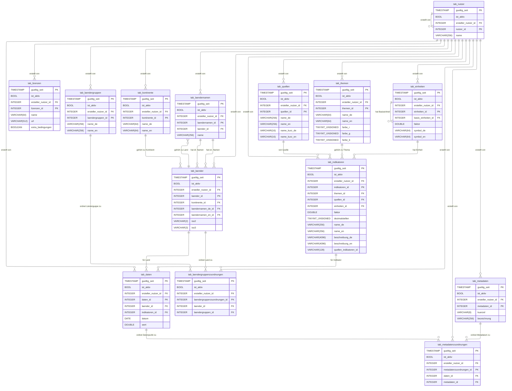

# Dokumantation für das INTSTAT Redesign

## Nutzertracking

Bisher haben wir uns alle mit dem selben Benutzernamen mit der Intstat verbunden. Dies können wir so beibehalten. Es gibt jedoch auch die Möglichkeit, aus Gründen der Nachvollziehbarkeit, zu tracken, welcher Benutzer welche Änderungen vorgenommen hat. Dazu wären folgende Schritte notwendig:

1. Erstellen eines Accounts für **jeden** Nutzer der Intstat.
2. Erstellen einer Tabelle `nutzer`.
3. Verweis auf die Tabelle `nutzer` in **jeder** Zeile **jeder** Tabelle mittels `ersteller_nutzer_id`.

## Versionierung

MySQL unterstützt keine automatische Versionierung, wie es z.B. MariaDB mit `WITH SYSTEM VERSIONING` tut. Mithilfe von zusätzlichen Spalten, _Views_, _SQL-Triggers_ und _Stored Procedures_ kann eine solche Versionierung jedoch manuell implementiert werden.

Jede Tabelle enthält dazu zwei weitere Spalten:

1. `gueltig_seit`: Speichert das Datum, an welchem die Zeile hinzugefügt wurde. Existiert keine weitere Zeile mit der gleichen `id` und einem späteren Datum in `gueltig_seit`, so ist die Zeile die aktuell gültige Zeile.

2. `ist_aktiv`: Enthält diese Spalte den Wert `FALSE` oder `0`, so zeigt das einen Löschvorgang an. Ist eine Zeile mit `ist_aktiv = FALSE` die aktuelle Zeile, so bedeutet das, das es keine aktuell gültige Version dieser Zeile gibt. Eine solche Zeile wird als _Tombstone_ oder _Grabstein_ bezeichnet.

SQL-Befehle wie `UPDATE` oder `DELETE` sind nicht erlaubt. Nur `INSERT` kann ausgeführt werden. Das wird über entsprechende _Trigger_ sichergestellt.

Zur Vereinfachung erfolgt die schreibende Interaktion mit der Datenbank ausschließlich über _Stored Procedures_. Die Lesende Interaktion kann über die Tabelle direkt erfolgen, ist jedoch einfacher über _Views_. So gibt es bspw. eine View, welche nur die aktuell gültigen zeilen anzeigt.

## Entity Relationship Diagramm


```mermaid
---
config:
    layout: elk
---
erDiagram

        tab_lizenzen {
            TIMESTAMP gueltig_seit PK
            BOOL ist_aktiv
            INTEGER ersteller_nutzer_id FK
            INTEGER lizenzen_id PK


                VARCHAR(64) name
                VARCHAR(512) url
                BOOLEAN extra_bedingungen
        }

        tab_nutzer ||--o{ tab_lizenzen : "erstellt von"


        tab_daten {
            TIMESTAMP gueltig_seit PK
            BOOL ist_aktiv
            INTEGER ersteller_nutzer_id FK
            INTEGER daten_id PK

                INTEGER laender_id FK
                INTEGER indikatoren_id FK

                DATE datum
                DOUBLE wert
        }

            tab_laender ||--o{ tab_daten : "für Land"
            tab_indikatoren ||--o{ tab_daten : "für Indikator"
        tab_nutzer ||--o{ tab_daten : "erstellt von"


        tab_laendergruppen {
            TIMESTAMP gueltig_seit PK
            BOOL ist_aktiv
            INTEGER ersteller_nutzer_id FK
            INTEGER laendergruppen_id PK


                VARCHAR(256) name_de
                VARCHAR(256) name_en
        }

        tab_nutzer ||--o{ tab_laendergruppen : "erstellt von"


        tab_laendergruppenzuordnungen {
            TIMESTAMP gueltig_seit PK
            BOOL ist_aktiv
            INTEGER ersteller_nutzer_id FK
            INTEGER laendergruppenzuordnungen_id PK

                INTEGER laender_id FK
                INTEGER laendergruppen_id FK

        }

            tab_laender ||--o{ tab_laendergruppenzuordnungen : "ordnet Land zu"
            tab_laendergruppen ||--o{ tab_laendergruppenzuordnungen : "ordnet Länderguppe zu"
        tab_nutzer ||--o{ tab_laendergruppenzuordnungen : "erstellt von"


        tab_metadaten {
            TIMESTAMP gueltig_seit PK
            BOOL ist_aktiv
            INTEGER ersteller_nutzer_id FK
            INTEGER metadaten_id PK


                VARCHAR(8) kuerzel
                VARCHAR(256) bezeichnung
        }

        tab_nutzer ||--o{ tab_metadaten : "erstellt von"


        tab_nutzer {
            TIMESTAMP gueltig_seit PK
            BOOL ist_aktiv
            INTEGER ersteller_nutzer_id FK
            INTEGER nutzer_id PK


                VARCHAR(256) name
        }

        tab_nutzer ||--o{ tab_nutzer : "erstellt von"


        tab_quellen {
            TIMESTAMP gueltig_seit PK
            BOOL ist_aktiv
            INTEGER ersteller_nutzer_id FK
            INTEGER quellen_id PK


                VARCHAR(256) name_de
                VARCHAR(256) name_en
                VARCHAR(16) name_kurz_de
                VARCHAR(16) name_kurz_en
        }

        tab_nutzer ||--o{ tab_quellen : "erstellt von"


        tab_indikatoren {
            TIMESTAMP gueltig_seit PK
            BOOL ist_aktiv
            INTEGER ersteller_nutzer_id FK
            INTEGER indikatoren_id PK

                INTEGER themen_id FK
                INTEGER quellen_id FK
                INTEGER einheiten_id FK

                DOUBLE faktor
                TINYINT_UNSIGNED dezimalstellen
                VARCHAR(256) name_de
                VARCHAR(256) name_en
                VARCHAR(4096) beschreibung_de
                VARCHAR(4096) beschreibung_en
                VARCHAR(128) quellen_indikatoren_id
        }

            tab_themen ||--o{ tab_indikatoren : "gehört zu Thema"
            tab_quellen ||--o{ tab_indikatoren : "von Quelle"
            tab_einheiten ||--o{ tab_indikatoren : "hat Einheit"
        tab_nutzer ||--o{ tab_indikatoren : "erstellt von"


        tab_themen {
            TIMESTAMP gueltig_seit PK
            BOOL ist_aktiv
            INTEGER ersteller_nutzer_id FK
            INTEGER themen_id PK


                VARCHAR(64) name_de
                VARCHAR(64) name_en
                TINYINT_UNSIGNED farbe_r
                TINYINT_UNSIGNED farbe_g
                TINYINT_UNSIGNED farbe_b
        }

        tab_nutzer ||--o{ tab_themen : "erstellt von"


        tab_laender {
            TIMESTAMP gueltig_seit PK
            BOOL ist_aktiv
            INTEGER ersteller_nutzer_id FK
            INTEGER laender_id PK

                INTEGER kontinente_id FK
                INTEGER laendernamen_de_id FK
                INTEGER laendernamen_en_id FK

                VARCHAR(2) iso2
                VARCHAR(3) iso3
        }

            tab_kontinente ||--o{ tab_laender : "gehört zu Kontinent"
            tab_laendernamen ||--o{ tab_laender : "hat dt. Namen"
            tab_laendernamen ||--o{ tab_laender : "hat en. Namen"
        tab_nutzer ||--o{ tab_laender : "erstellt von"


        tab_einheiten {
            TIMESTAMP gueltig_seit PK
            BOOL ist_aktiv
            INTEGER ersteller_nutzer_id FK
            INTEGER einheiten_id PK

                INTEGER basis_einheiten_id FK

                DOUBLE faktor
                VARCHAR(64) symbol_de
                VARCHAR(64) symbol_en
        }

            tab_einheiten ||--o{ tab_einheiten : "hat Basiseinheit"
        tab_nutzer ||--o{ tab_einheiten : "erstellt von"


        tab_laendernamen {
            TIMESTAMP gueltig_seit PK
            BOOL ist_aktiv
            INTEGER ersteller_nutzer_id FK
            INTEGER laendernamen_id PK

                INTEGER laender_id FK

                VARCHAR(256) name
        }

            tab_laender ||--o{ tab_laendernamen : "gehört zu Land"
        tab_nutzer ||--o{ tab_laendernamen : "erstellt von"


        tab_metadatenzuordnungen {
            TIMESTAMP gueltig_seit PK
            BOOL ist_aktiv
            INTEGER ersteller_nutzer_id FK
            INTEGER metadatenzuordnungen_id PK

                INTEGER daten_id FK
                INTEGER metadaten_id FK

        }

            tab_daten ||--o{ tab_metadatenzuordnungen : "ordnet Datenpunkt zu"
            tab_metadaten ||--o{ tab_metadatenzuordnungen : "ordnet Metadatum zu"
        tab_nutzer ||--o{ tab_metadatenzuordnungen : "erstellt von"


        tab_kontinente {
            TIMESTAMP gueltig_seit PK
            BOOL ist_aktiv
            INTEGER ersteller_nutzer_id FK
            INTEGER kontinente_id PK


                VARCHAR(64) name_de
                VARCHAR(64) name_en
        }

        tab_nutzer ||--o{ tab_kontinente : "erstellt von"


```

## Tabellen

### tab_lizenzen

Tabelle zur Verwaltung der Lizenzen, unter denen die statistischen Daten veröffentlicht werden.

#### Spalten

|Name|Typ|Nicht NULL|Standardwert|Beschreibung|
|----|---|----------|------------|------------|
|name|VARCHAR(64)|True|''|Name der Lizenz (z.B. CC BY 4.0).|
|url|VARCHAR(512)|True|''|URL zur vollständigen Lizenzbeschreibung.|
|extra_bedingungen|BOOLEAN|True|0|Gibt an, ob zusätzliche Bedingungen für die Nutzung der Daten bestehen.|


### tab_daten

Tabelle für die Speicherung von statistischen Einzelwerten (Zeitreihen) zu Ländern und Indikatoren.

#### Spalten

|Name|Typ|Nicht NULL|Standardwert|Beschreibung|
|----|---|----------|------------|------------|
|datum|DATE|True|'2000-01-01'|Datum, an dem der Wert erhoben oder veröffentlicht wurde.|
|wert|DOUBLE|True|0|Erfasster numerischer Wert für das jeweilige Land und den Indikator am angegebenen Datum.|

#### Fremdschlüssel

|Name|Referenztabelle|Nicht NULL|Beschreibung|
|----|---------------|----------|------------|
|laender|tab_laender|True|Verweis auf das Land, für das der Wert gilt.|
|indikatoren|tab_indikatoren|True|Verweis auf den Indikator, zu dem der Wert gehört.|

### tab_laendergruppen

Tabelle zur Verwaltung von Ländergruppen (z.B. EU, OECD, G7).

#### Spalten

|Name|Typ|Nicht NULL|Standardwert|Beschreibung|
|----|---|----------|------------|------------|
|name_de|VARCHAR(256)|True|''|Name der Ländergruppe auf Deutsch.|
|name_en|VARCHAR(256)|True|''|Name der Ländergruppe auf Englisch.|


### tab_laendergruppenzuordnungen

Tabelle zur Zuordnung von Ländern zu Ländergruppen (z.B. Mitgliedschaft eines Landes in einer Gruppe).


#### Fremdschlüssel

|Name|Referenztabelle|Nicht NULL|Beschreibung|
|----|---------------|----------|------------|
|laender|tab_laender|True|Verweis auf das zugeordnete Land.|
|laendergruppen|tab_laendergruppen|True|Verweis auf die zugeordnete Ländergruppe.|

### tab_metadaten

Tabelle zur Verwaltung von Metadaten, die Datenpunkten zugeordnet werden können (z.B. methodische Hinweise, Fußnoten).

#### Spalten

|Name|Typ|Nicht NULL|Standardwert|Beschreibung|
|----|---|----------|------------|------------|
|kuerzel|VARCHAR(8)|True|''|Kürzel für das Metadatum.|
|bezeichnung|VARCHAR(256)|True|''|Ausführliche Bezeichnung des Metadatums.|


### tab_nutzer

Diese Tabelle speichert alle Nutzer.

#### Spalten

|Name|Typ|Nicht NULL|Standardwert|Beschreibung|
|----|---|----------|------------|------------|
|name|VARCHAR(256)|True|''|Name des Nutzers.|


### tab_quellen

Tabelle zur Verwaltung von Datenquellen.

#### Spalten

|Name|Typ|Nicht NULL|Standardwert|Beschreibung|
|----|---|----------|------------|------------|
|name_de|VARCHAR(256)|True|''|Vollständiger Name der Quelle auf Deutsch.|
|name_en|VARCHAR(256)|True|''|Vollständiger Name der Quelle auf Englisch.|
|name_kurz_de|VARCHAR(16)|True|''|Kurzer Name der Quelle auf Deutsch.|
|name_kurz_en|VARCHAR(16)|True|''|Kurzer Name der Quelle auf Englisch.|


### tab_indikatoren

Tabelle zur Verwaltung der statistischen Indikatoren.

#### Spalten

|Name|Typ|Nicht NULL|Standardwert|Beschreibung|
|----|---|----------|------------|------------|
|faktor|DOUBLE|True|0|Faktor zur Multiplikation mit dem Indikatorwerts, um den korrekten Wert zu erhalten.|
|dezimalstellen|TINYINT UNSIGNED|True|0|Anzahl der Dezimalstellen, mit denen der Wert angezeigt wird.|
|name_de|VARCHAR(256)|True|''|Name des Indikators auf Deutsch.|
|name_en|VARCHAR(256)|True|''|Name des Indikators auf Englisch.|
|beschreibung_de|VARCHAR(4096)|True|''|Ausführliche Beschreibung des Indikators auf Deutsch.|
|beschreibung_en|VARCHAR(4096)|True|''|Ausführliche Beschreibung des Indikators auf Englisch.|
|quellen_indikatoren_id|VARCHAR(128)|False|''|ID des Indikators bei der jeweiligen Quelle (optional).|

#### Fremdschlüssel

|Name|Referenztabelle|Nicht NULL|Beschreibung|
|----|---------------|----------|------------|
|themen|tab_themen|True|Verweis auf das Thema, dem der Indikator zugeordnet ist.|
|quellen|tab_quellen|True|Verweis auf die Quelle, aus der die Daten für den Indikator stammen.|
|einheiten|tab_einheiten|True|Verweis auf die Einheit, in der der Indikator gemessen wird.|

### tab_themen

Tabelle welche Themen verwaltet, denen Indikatoren zugeordnet sind.

#### Spalten

|Name|Typ|Nicht NULL|Standardwert|Beschreibung|
|----|---|----------|------------|------------|
|name_de|VARCHAR(64)|True|''|Name des Themas auf Deutsch.|
|name_en|VARCHAR(64)|True|''|Name des Themas auf Englisch.|
|farbe_r|TINYINT UNSIGNED|True|0|Rotwert der Farbzuordnung für das Thema (0-255).|
|farbe_g|TINYINT UNSIGNED|True|0|Grünwert der Farbzuordnung für das Thema (0-255).|
|farbe_b|TINYINT UNSIGNED|True|0|Blauwert der Farbzuordnung für das Thema (0-255).|


### tab_laender

Tabelle zur Verwaltung der Länder mit ISO-Codes und Namensreferenzen.

#### Spalten

|Name|Typ|Nicht NULL|Standardwert|Beschreibung|
|----|---|----------|------------|------------|
|iso2|VARCHAR(2)|True|''|ISO-2-Ländercode gemäß internationalem Standard (z.B. 'DE' für Deutschland).|
|iso3|VARCHAR(3)|True|''|ISO-3-Ländercode gemäß internationalem Standard (z.B. 'DEU' für Deutschland).|

#### Fremdschlüssel

|Name|Referenztabelle|Nicht NULL|Beschreibung|
|----|---------------|----------|------------|
|kontinente|tab_kontinente|True|Verweis auf den Kontinent, dem das Land zugeordnet ist.|
|laendernamen_de|tab_laendernamen|True|Verweis auf den deutschen Namen des Landes.|
|laendernamen_en|tab_laendernamen|True|Verweis auf den englischen Namen des Landes.|

### tab_einheiten

Tabelle zur Verwaltung der Einheiten, in denen statistische Werte angegeben werden.

#### Spalten

|Name|Typ|Nicht NULL|Standardwert|Beschreibung|
|----|---|----------|------------|------------|
|faktor|DOUBLE|True|0|Faktor zur Umrechnung in die Basiseinheit.|
|symbol_de|VARCHAR(64)|True|''|Symbol der Einheit auf Deutsch.|
|symbol_en|VARCHAR(64)|True|''|Symbol der Einheit auf Englisch.|

#### Fremdschlüssel

|Name|Referenztabelle|Nicht NULL|Beschreibung|
|----|---------------|----------|------------|
|basis_einheiten|tab_einheiten|False|Optionale Referenz auf eine Basiseinheit, falls die Einheit abgeleitet ist.|

### tab_laendernamen

Tabelle zuer Verwaltung von Ländernamen. Ein Land kann mehrere Ländernamen haben. Jedes Land hat einen deutschen und einen englischen Namen.

#### Spalten

|Name|Typ|Nicht NULL|Standardwert|Beschreibung|
|----|---|----------|------------|------------|
|name|VARCHAR(256)|True|''|Name eines Landes.|

#### Fremdschlüssel

|Name|Referenztabelle|Nicht NULL|Beschreibung|
|----|---------------|----------|------------|
|laender|tab_laender|False|Verweis auf das Land, dem der Name zugeordnet ist. (optional)|

### tab_metadatenzuordnungen

Diese Tabelle ordnet Datenpunkten ihre Metadaten zu.


#### Fremdschlüssel

|Name|Referenztabelle|Nicht NULL|Beschreibung|
|----|---------------|----------|------------|
|daten|tab_daten|True|Verweis auf den zugeordneten Datenpunkt.|
|metadaten|tab_metadaten|True|Verweis auf das zugeordnete Metadatum.|

### tab_kontinente

Tabelle zur Verwaltung der Kontinente, denen Länder zugeordnet werden können.

#### Spalten

|Name|Typ|Nicht NULL|Standardwert|Beschreibung|
|----|---|----------|------------|------------|
|name_de|VARCHAR(64)|True|''|Name des Kontinents auf Deutsch.|
|name_en|VARCHAR(64)|True|''|Name des Kontinents auf Englisch.|


## Interaktion mit der Datenbank

### Einfügen einer Zeile (`INSERT`)

```SQL
SET @neue_id = 0;

CALL insert_into_kontinente(
    "atlantis",
    "Atlantis",
    @neue_id
);

SELECT @neue_id;
```

### Auslesen einer aktuell gültigen Zeile (`SELECT`)

#### Aus der Tabelle

```SQL
SELECT t.*
from tab_kontinente t
INNER JOIN (
    SELECT kontinente_id, MAX(gueltig_seit) AS max_gueltig_seit
    FROM tab_kontinente
    GROUP BY kontinente_id
) latest
ON t.kontinente_id = latest.kontinente_id
AND t.gueltig_seit = latest.max_gueltig_seit
WHERE t.ist_aktiv;
```

#### Aus der View

```SQL
SELECT * from view_kontinente_aktuell;
```

### Aktualisieren einer Zeile (`UPDATE`)

```SQL
CALL update_value_kontinente_name_de(
    atlantis_id,
    'Atlantis'
);
```

### Löschen einer Zeile (`DELETE`)

```SQL
CALL delete_from_kontinente(
    atlantis_id
);
```

### Auslesen einer älteren Version einer Zeile (`SELECT`)

```SQL
SELECT t.*
from tab_kontinente t
INNER JOIN (
    SELECT kontinente_id, MAX(gueltig_seit) AS max_gueltig_seit
    FROM tab_kontinente
    WHERE gueltig_seit <= '2025-12-31 12:00:00'
    GROUP BY kontinente_id
) latest
ON t.kontinente_id = latest.kontinente_id
AND t.gueltig_seit = latest.max_gueltig_seit
WHERE t.ist_aktiv;
```
