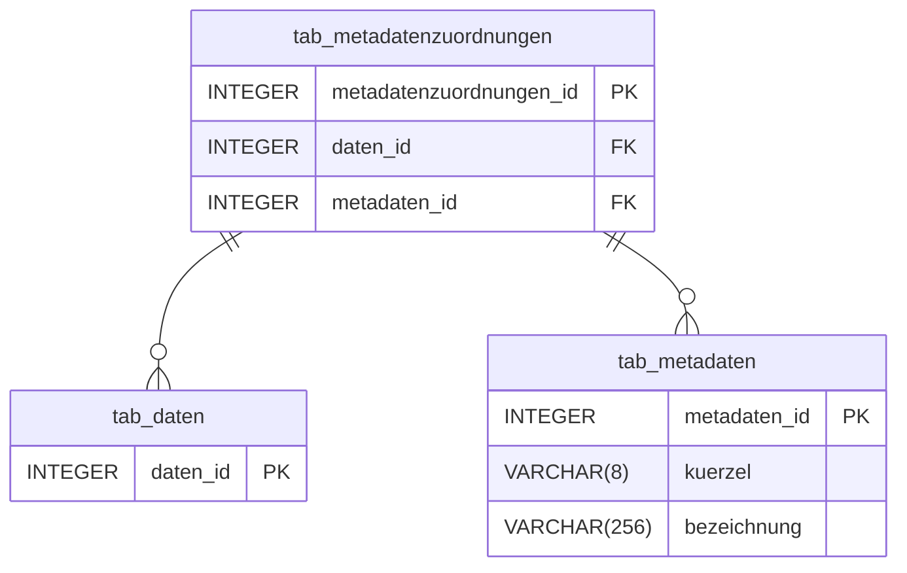
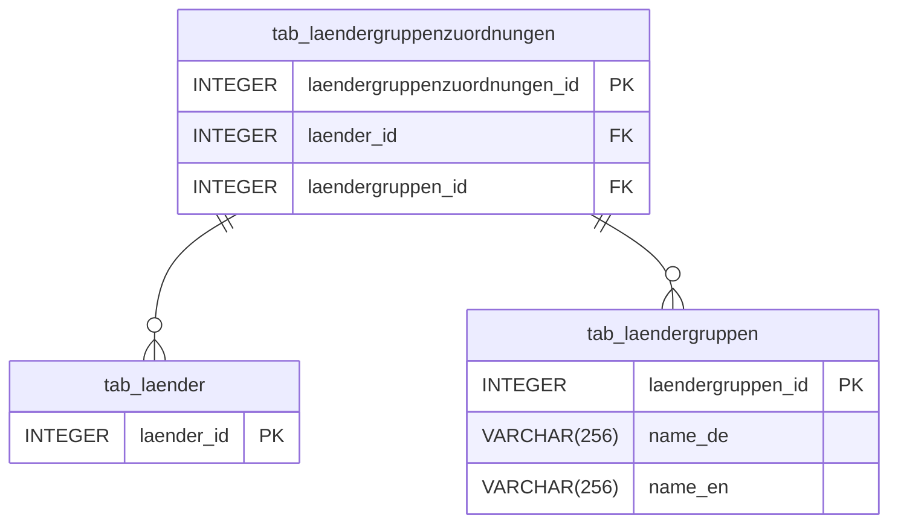
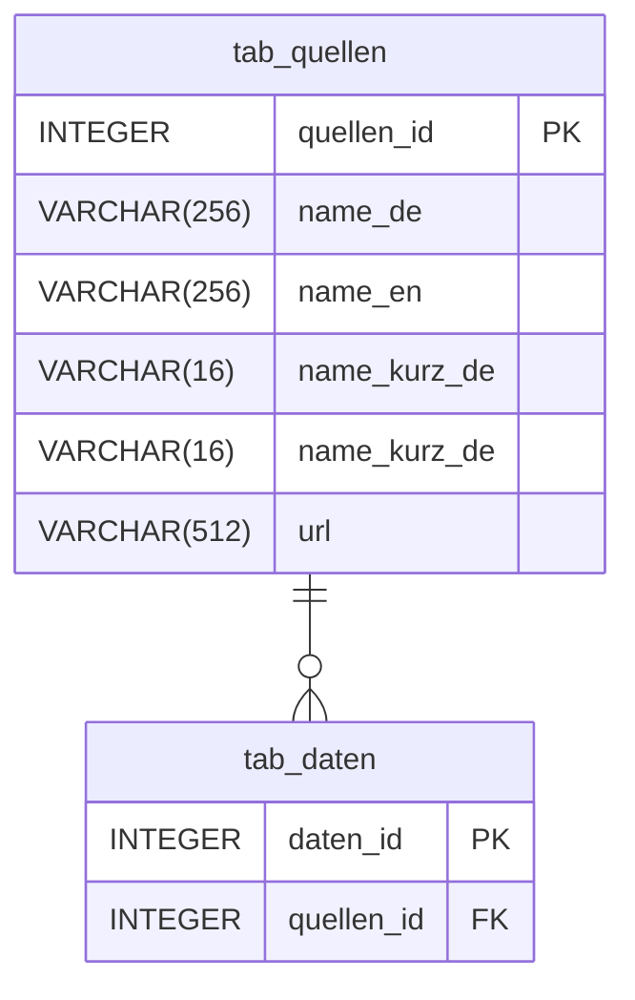
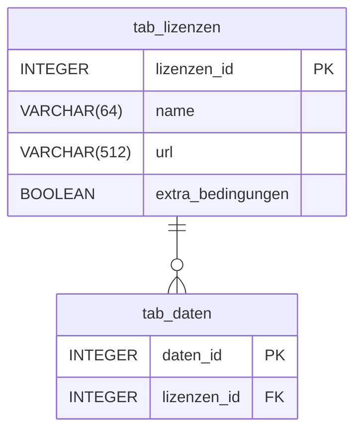
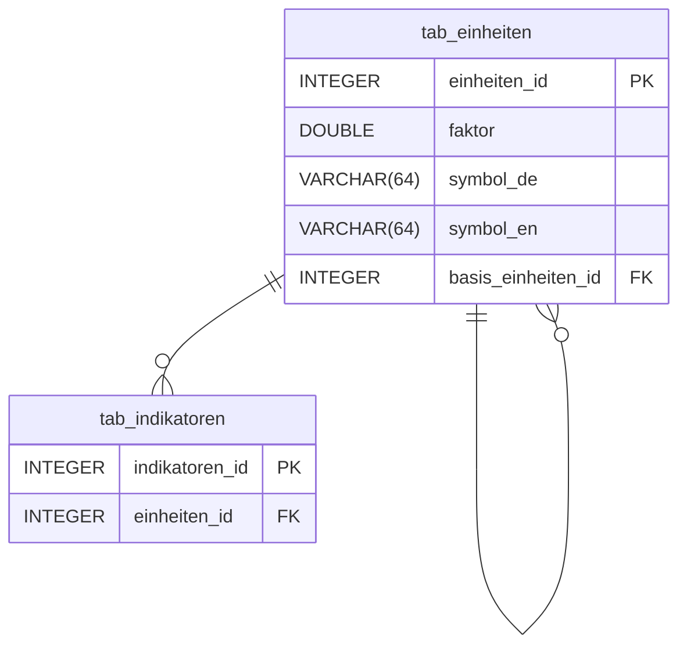
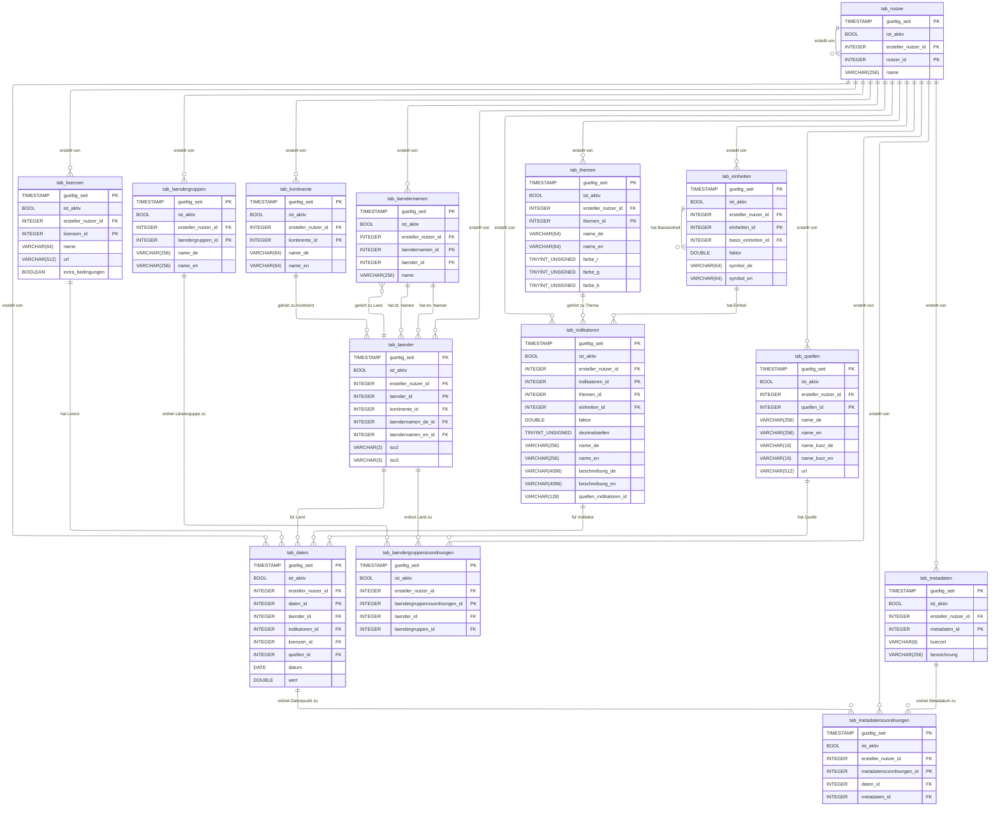

# Dokumentation Intstat2

## Inhalt

- [Funktionale Features](#funktionale-features)
    - [Versionierung](#versionierung)
    - [Nutzertracking](#nutzertracking)
- [Inhaltliche Features](#inhaltliche-features)
    - [Metadaten](#metadaten)
    - [Ländergruppen](#ländergruppen)
    - [Quellen](#quellen)
    - [Lizenzen](#lizenzen)
    - [Einheiten](#einheiten)
- [ER-Diagramm](#entity-relationship-diagramm)
- [Tabellen](#tabellen)
    - [tab_lizenzen](#tab_lizenzen)
    - [tab_daten](#tab_daten)
    - [tab_laendergruppen](#tab_laendergruppen)
    - [tab_laendergruppenzuordnungen](#tab_laendergruppenzuordnungen)
    - [tab_metadaten](#tab_metadaten)
    - [tab_nutzer](#tab_nutzer)
    - [tab_quellen](#tab_quellen)
    - [tab_indikatoren](#tab_indikatoren)
    - [tab_themen](#tab_themen)
    - [tab_laender](#tab_laender)
    - [tab_einheiten](#tab_einheiten)
    - [tab_laendernamen](#tab_laendernamen)
    - [tab_metadatenzuordnungen](#tab_metadatenzuordnungen)
    - [tab_kontinente](#tab_kontinente)
- [Benutzung der Datenbank](#benutzung-der-datenbank)
    - [Einfügen einer Zeile](#einfügen-einer-zeile)
    - [Auslesen einer aktuell gültigen Zeile](#auslesen-einer-aktuell-gültigen-zeile)
    - [Aktualisieren einer Zeile](#aktualisieren-einer-zeile)
    - [Löschen einer Zeile](#löschen-einer-zeile)
    - [Auslesen einer älteren Version einer Zeile](#auslesen-einer-älteren-version-einer-zeile)

## Funktionale Features

### Versionierung

Um Änderungen an den Daten auch nachträglich nachvollziehbar zu machen, arbeitet die Datenbank mit einem Versionierungssystem ähnlich [SCD Typ 2](https://de.wikipedia.org/wiki/Slowly_Changing_Dimensions#Typ_2).

Grundsätzlich werden dabei für vollständige Nachvollziehbarkeit niemals Daten gelöscht. Jede Veränderung oder Löschung eines Datensatzes zieht stattdessen die Erstellung eines neuen Datensatzes nach sich.

Um dies zu realisieren besitzt jede Tabelle die beiden Spalten `gueltig_seit` und `ist_aktiv`. Die Spalte `gueltig_seit` beinhaltet das Datum der Erstellung einer Zeile. Die Spalte `ist_aktiv` gibt an, ob es sich bei einer Zeile um einen aktiven Datensatz handelt.

Die `id`-Spalte einer Tabelle bildet zusammen mit `gueltig_seit` den Primärschlüssel. Für alle Zeilen mit identischer `id` ist jene mit dem jüngsten Eintrag in `gueltig_seit` die aktuell gültige Zeile. Alle anderen Zeilen gehören zur Historie und können im normalen Betrieb ignoriert werden.

Beim Ändern einer bestehenden Zeile wird also tatsächlich eine Neue Zeile mit dem aktuellen Datum in `gueltig_seit` erzeugt, siehe nachfolgendes Beispiel:

|gueltig_seit|ist_aktiv|ersteller_nutzer_id|kontinente_id|name_de|name_en|
|------------|---------|-------------------|-------------|-------|-------|
|  2026-01-01|        1|                 42|            3| Europa| Europa|

Dem Nutzer ist ein Schreibfehler im englischen Namen des Kontinentes Europa aufgefallen. Er führt am zweiten Februar folgenden SQL-Befehl aus, um den Fehler zu korrigieren:

```SQL
CALL update_value_kontinente_name_en(3, 'Europe');
```

Das Ergebnis ist folgendes:

|gueltig_seit|ist_aktiv|ersteller_nutzer_id|kontinente_id|name_de|name_en|
|------------|---------|-------------------|-------------|-------|-------|
|  2026-01-01|        1|                 42|            3| Europa| Europa|
|  2026-02-02|        1|                 42|            3| Europa| Europe|


Beim Löschen einer Zeile wird stattdessen eine neue Zeile mit `ist_aktiv = 0` dem aktuellen Datum in `gueltig_seit` erzeugt. Folgendes Beispiel verdeutlicht das Löschen:

Der Nutzer löscht nun am dritten März den Eintrag für Europa durch Ausführen des folgenden SQL-Befehles:

```SQL
CALL delete_from_kontinente(3);
```

Das Ergebnis ist folgendes:

|gueltig_seit|ist_aktiv|ersteller_nutzer_id|kontinente_id|name_de|name_en|
|------------|---------|-------------------|-------------|-------|-------|
|  2026-01-01|        1|                 42|            3| Europa| Europa|
|  2026-02-02|        1|                 42|            3| Europa| Europe|
|  2026-03-03|        0|                 42|            3| Europa| Europe|

Um die Arbeit mit der Datenbank zu vereinfachen existieren für jede Tabelle `tab_<NAME>` zwei Views:

- `view_<NAME>_historie`
- `view_<NAME>_aktuell`

`view_<NAME>_historie` enthält den gesamten Inhalt der Tabelle sortiert nach `id` und `gueltig_seit`.

`view_<NAME>_aktuell` enthält nur die aktuell gültigen Zeilen. Für jede `id` wird nur die Zeile mit dem jüngsten Wert in `gueltig_seit` angezeigt. Zeilen mit `ist_aktiv = 0` werden nicht angezeigt. Diese View simuliert das Aussehen einer Tabelle ohne Versionierung und Historie.

### Nutzertracking

Die Tabelle `tab_nutzer` enthält alle Nutzer der Datenbank. Interagiert ein Nutzer, welcher noch nicht in `tab_nutzer` enthalten ist, mit der Datenbank, so wird er automatisch zu `tab_nutzer` hinzugefügt.

Jede Tabelle besitzt die Spalte `ersteller_nutzer_id` welche ein Fremdschlüssel für die Tabelle `tab_nutzer` ist. Somit enthält jede Zeile jeder Tabelle einen Verweis auf einen Nutzer. Dieser Verweis wird automatisch erstellt und gibt den Nutzer an, welcher für die Erstellung der entsprechenden Zeile verantwortlich ist.

Das automatische Hizufügen von Nutzern und das automatische Erstellen der Nutzerverweise funktioniert nur, wenn zur Interaktion mit der Datenbank die vordefinierten _Stored procedures_ verwendet werden.

Ein ausschließlich lesender Zugriff erzeugt keine neuen Nutzer oder Nutzerverweise.

## Inhaltliche Features

### Metadaten

Die Datenbank ermöglicht die flexible Zuordnung von Metadaten zu einzelnen Datenpunkten. Metadaten dienen hier als zusätzliche Informationen, die den Kontext, die Qualität oder die Besonderheiten eines statistischen Werts beschreiben – etwa methodische Hinweise, Fußnoten oder spezifische Anmerkungen zur Datenerhebung.


```mermaid
erDiagram
    tab_daten {
        INTEGER daten_id PK
    }

    tab_metadaten {
        INTEGER metadaten_id PK
        VARCHAR(8) kuerzel
        VARCHAR(256) bezeichnung
    }

    tab_metadatenzuordnungen {
        INTEGER metadatenzuordnungen_id PK
        INTEGER daten_id FK
        INTEGER metadaten_id FK
    }

    tab_metadatenzuordnungen ||--o{ tab_daten : ""
    tab_metadatenzuordnungen ||--o{ tab_metadaten : ""
```

### Ländergruppen

Ländergruppen ermöglichen die logische Gruppierung von Ländern nach politischen, wirtschaftlichen oder geografischen Kriterien (z.B. EU, OECD, G7). Dies vereinfacht Abfragen und Analysen, die sich auf bestimmte Länderblöcke beziehen.


```mermaid
erDiagram
    tab_laender {
        INTEGER laender_id PK
    }

    tab_laendergruppen {
        INTEGER laendergruppen_id PK
        VARCHAR(256) name_de
        VARCHAR(256) name_en
    }

    tab_laendergruppenzuordnungen {
        INTEGER laendergruppenzuordnungen_id PK
        INTEGER laender_id FK
        INTEGER laendergruppen_id FK
    }

    tab_laendergruppenzuordnungen ||--o{ tab_laender : ""
    tab_laendergruppenzuordnungen ||--o{ tab_laendergruppen : ""
```

### Quellen

Die Datenbank verwaltet Quellenangaben für jeden Datenpunkt einzeln, um auch Indikatoren mit gemischten Quellen unterstützen zu können.


```mermaid
erDiagram
    tab_daten {
        INTEGER daten_id PK
        INTEGER quellen_id FK
    }

    tab_quellen {
        INTEGER quellen_id PK
        VARCHAR(256) name_de
        VARCHAR(256) name_en
        VARCHAR(16) name_kurz_de
        VARCHAR(16) name_kurz_de
        VARCHAR(512) url
    }

    tab_quellen ||--o{ tab_daten : ""
```

### Lizenzen

Jedem Datenpunkt ist eine Lizenz zugeordnet. Die Lizenz gibt an, wie der Datenpunkt verwendet werden darf. Die Spalte `extra_bedingungen` gibt an, ob weitere Bedingungen bei der Verwendung des Datenpunktes zu beachten sind.


```mermaid
erDiagram
    tab_daten {
        INTEGER daten_id PK
        INTEGER lizenzen_id FK
    }

    tab_lizenzen {
        INTEGER lizenzen_id PK
        VARCHAR(64) name
        VARCHAR(512) url
        BOOLEAN extra_bedingungen
    }

    tab_lizenzen ||--o{ tab_daten : ""
```

### Einheiten

Jeder Indikator besitzt eine Einheit. Einheiten lassen sich durch einen Faktor und Angabe der jeweiligen Basiseinheit in einander umrechnen (z.B. m² in km²).


```mermaid
erDiagram
    tab_einheiten {
        INTEGER einheiten_id PK
        DOUBLE faktor
        VARCHAR(64) symbol_de
        VARCHAR(64) symbol_en
        INTEGER basis_einheiten_id FK
    }

    tab_indikatoren {
        INTEGER indikatoren_id PK
        INTEGER einheiten_id FK
    }

    tab_einheiten ||--o{ tab_indikatoren : ""
    tab_einheiten ||--o{ tab_einheiten : ""
```


## Entity Relationship Diagramm


```mermaid
---
config:
    layout: elk
---
erDiagram

        tab_lizenzen {
            TIMESTAMP gueltig_seit PK
            BOOL ist_aktiv
            INTEGER ersteller_nutzer_id FK
            INTEGER lizenzen_id PK


                VARCHAR(64) name
                VARCHAR(512) url
                BOOLEAN extra_bedingungen
        }

        tab_nutzer ||--o{ tab_lizenzen : "erstellt von"


        tab_daten {
            TIMESTAMP gueltig_seit PK
            BOOL ist_aktiv
            INTEGER ersteller_nutzer_id FK
            INTEGER daten_id PK

                INTEGER laender_id FK
                INTEGER indikatoren_id FK
                INTEGER lizenzen_id FK
                INTEGER quellen_id FK

                DATE datum
                DOUBLE wert
        }

            tab_laender ||--o{ tab_daten : "für Land"
            tab_indikatoren ||--o{ tab_daten : "für Indikator"
            tab_lizenzen ||--o{ tab_daten : "hat Lizenz"
            tab_quellen ||--o{ tab_daten : "hat Quelle"
        tab_nutzer ||--o{ tab_daten : "erstellt von"


        tab_laendergruppen {
            TIMESTAMP gueltig_seit PK
            BOOL ist_aktiv
            INTEGER ersteller_nutzer_id FK
            INTEGER laendergruppen_id PK


                VARCHAR(256) name_de
                VARCHAR(256) name_en
        }

        tab_nutzer ||--o{ tab_laendergruppen : "erstellt von"


        tab_laendergruppenzuordnungen {
            TIMESTAMP gueltig_seit PK
            BOOL ist_aktiv
            INTEGER ersteller_nutzer_id FK
            INTEGER laendergruppenzuordnungen_id PK

                INTEGER laender_id FK
                INTEGER laendergruppen_id FK

        }

            tab_laender ||--o{ tab_laendergruppenzuordnungen : "ordnet Land zu"
            tab_laendergruppen ||--o{ tab_laendergruppenzuordnungen : "ordnet Länderguppe zu"
        tab_nutzer ||--o{ tab_laendergruppenzuordnungen : "erstellt von"


        tab_metadaten {
            TIMESTAMP gueltig_seit PK
            BOOL ist_aktiv
            INTEGER ersteller_nutzer_id FK
            INTEGER metadaten_id PK


                VARCHAR(8) kuerzel
                VARCHAR(256) bezeichnung
        }

        tab_nutzer ||--o{ tab_metadaten : "erstellt von"


        tab_nutzer {
            TIMESTAMP gueltig_seit PK
            BOOL ist_aktiv
            INTEGER ersteller_nutzer_id FK
            INTEGER nutzer_id PK


                VARCHAR(256) name
        }

        tab_nutzer ||--o{ tab_nutzer : "erstellt von"


        tab_quellen {
            TIMESTAMP gueltig_seit PK
            BOOL ist_aktiv
            INTEGER ersteller_nutzer_id FK
            INTEGER quellen_id PK


                VARCHAR(256) name_de
                VARCHAR(256) name_en
                VARCHAR(16) name_kurz_de
                VARCHAR(16) name_kurz_en
                VARCHAR(512) url
        }

        tab_nutzer ||--o{ tab_quellen : "erstellt von"


        tab_indikatoren {
            TIMESTAMP gueltig_seit PK
            BOOL ist_aktiv
            INTEGER ersteller_nutzer_id FK
            INTEGER indikatoren_id PK

                INTEGER themen_id FK
                INTEGER einheiten_id FK

                DOUBLE faktor
                TINYINT_UNSIGNED dezimalstellen
                VARCHAR(256) name_de
                VARCHAR(256) name_en
                VARCHAR(4096) beschreibung_de
                VARCHAR(4096) beschreibung_en
                VARCHAR(128) quellen_indikatoren_id
        }

            tab_themen ||--o{ tab_indikatoren : "gehört zu Thema"
            tab_einheiten ||--o{ tab_indikatoren : "hat Einheit"
        tab_nutzer ||--o{ tab_indikatoren : "erstellt von"


        tab_themen {
            TIMESTAMP gueltig_seit PK
            BOOL ist_aktiv
            INTEGER ersteller_nutzer_id FK
            INTEGER themen_id PK


                VARCHAR(64) name_de
                VARCHAR(64) name_en
                TINYINT_UNSIGNED farbe_r
                TINYINT_UNSIGNED farbe_g
                TINYINT_UNSIGNED farbe_b
        }

        tab_nutzer ||--o{ tab_themen : "erstellt von"


        tab_laender {
            TIMESTAMP gueltig_seit PK
            BOOL ist_aktiv
            INTEGER ersteller_nutzer_id FK
            INTEGER laender_id PK

                INTEGER kontinente_id FK
                INTEGER laendernamen_de_id FK
                INTEGER laendernamen_en_id FK

                VARCHAR(2) iso2
                VARCHAR(3) iso3
        }

            tab_kontinente ||--o{ tab_laender : "gehört zu Kontinent"
            tab_laendernamen ||--o{ tab_laender : "hat dt. Namen"
            tab_laendernamen ||--o{ tab_laender : "hat en. Namen"
        tab_nutzer ||--o{ tab_laender : "erstellt von"


        tab_einheiten {
            TIMESTAMP gueltig_seit PK
            BOOL ist_aktiv
            INTEGER ersteller_nutzer_id FK
            INTEGER einheiten_id PK

                INTEGER basis_einheiten_id FK

                DOUBLE faktor
                VARCHAR(64) symbol_de
                VARCHAR(64) symbol_en
        }

            tab_einheiten ||--o{ tab_einheiten : "hat Basiseinheit"
        tab_nutzer ||--o{ tab_einheiten : "erstellt von"


        tab_laendernamen {
            TIMESTAMP gueltig_seit PK
            BOOL ist_aktiv
            INTEGER ersteller_nutzer_id FK
            INTEGER laendernamen_id PK

                INTEGER laender_id FK

                VARCHAR(256) name
        }

            tab_laender ||--o{ tab_laendernamen : "gehört zu Land"
        tab_nutzer ||--o{ tab_laendernamen : "erstellt von"


        tab_metadatenzuordnungen {
            TIMESTAMP gueltig_seit PK
            BOOL ist_aktiv
            INTEGER ersteller_nutzer_id FK
            INTEGER metadatenzuordnungen_id PK

                INTEGER daten_id FK
                INTEGER metadaten_id FK

        }

            tab_daten ||--o{ tab_metadatenzuordnungen : "ordnet Datenpunkt zu"
            tab_metadaten ||--o{ tab_metadatenzuordnungen : "ordnet Metadatum zu"
        tab_nutzer ||--o{ tab_metadatenzuordnungen : "erstellt von"


        tab_kontinente {
            TIMESTAMP gueltig_seit PK
            BOOL ist_aktiv
            INTEGER ersteller_nutzer_id FK
            INTEGER kontinente_id PK


                VARCHAR(64) name_de
                VARCHAR(64) name_en
        }

        tab_nutzer ||--o{ tab_kontinente : "erstellt von"


```

## Tabellen

### tab_lizenzen

Tabelle zur Verwaltung der Lizenzen, unter denen die statistischen Daten veröffentlicht werden.

#### Spalten

|Name|Typ|Nicht NULL|Standardwert|Beschreibung|
|----|---|----------|------------|------------|
|name|VARCHAR(64)|True|''|Name der Lizenz (z.B. CC BY 4.0).|
|url|VARCHAR(512)|True|''|URL zur vollständigen Lizenzbeschreibung.|
|extra_bedingungen|BOOLEAN|True|0|Gibt an, ob zusätzliche Bedingungen für die Nutzung der Daten bestehen.|


### tab_daten

Tabelle für die Speicherung von statistischen Einzelwerten (Zeitreihen) zu Ländern und Indikatoren.

#### Spalten

|Name|Typ|Nicht NULL|Standardwert|Beschreibung|
|----|---|----------|------------|------------|
|datum|DATE|True|'2000-01-01'|Datum, an dem der Wert erhoben oder veröffentlicht wurde.|
|wert|DOUBLE|True|0|Erfasster numerischer Wert für das jeweilige Land und den Indikator am angegebenen Datum.|

#### Fremdschlüssel

|Name|Referenztabelle|Nicht NULL|Beschreibung|
|----|---------------|----------|------------|
|laender|tab_laender|True|Verweis auf das Land, für das der Wert gilt.|
|indikatoren|tab_indikatoren|True|Verweis auf den Indikator, zu dem der Wert gehört.|
|lizenzen|tab_lizenzen|False|Verweis auf die Lizenz, unter welcher der Wert steht.|
|quellen|tab_quellen|False|Verweis auf die Quelle, aus welcher der Wert stammt.|

### tab_laendergruppen

Tabelle zur Verwaltung von Ländergruppen (z.B. EU, OECD, G7).

#### Spalten

|Name|Typ|Nicht NULL|Standardwert|Beschreibung|
|----|---|----------|------------|------------|
|name_de|VARCHAR(256)|True|''|Name der Ländergruppe auf Deutsch.|
|name_en|VARCHAR(256)|True|''|Name der Ländergruppe auf Englisch.|


### tab_laendergruppenzuordnungen

Tabelle zur Zuordnung von Ländern zu Ländergruppen (z.B. Mitgliedschaft eines Landes in einer Gruppe).


#### Fremdschlüssel

|Name|Referenztabelle|Nicht NULL|Beschreibung|
|----|---------------|----------|------------|
|laender|tab_laender|True|Verweis auf das zugeordnete Land.|
|laendergruppen|tab_laendergruppen|True|Verweis auf die zugeordnete Ländergruppe.|

### tab_metadaten

Tabelle zur Verwaltung von Metadaten, die Datenpunkten zugeordnet werden können (z.B. methodische Hinweise, Fußnoten).

#### Spalten

|Name|Typ|Nicht NULL|Standardwert|Beschreibung|
|----|---|----------|------------|------------|
|kuerzel|VARCHAR(8)|True|''|Kürzel für das Metadatum.|
|bezeichnung|VARCHAR(256)|True|''|Ausführliche Bezeichnung des Metadatums.|


### tab_nutzer

Diese Tabelle speichert alle Nutzer.

#### Spalten

|Name|Typ|Nicht NULL|Standardwert|Beschreibung|
|----|---|----------|------------|------------|
|name|VARCHAR(256)|True|''|Name des Nutzers.|


### tab_quellen

Tabelle zur Verwaltung von Datenquellen.

#### Spalten

|Name|Typ|Nicht NULL|Standardwert|Beschreibung|
|----|---|----------|------------|------------|
|name_de|VARCHAR(256)|True|''|Vollständiger Name der Quelle auf Deutsch.|
|name_en|VARCHAR(256)|True|''|Vollständiger Name der Quelle auf Englisch.|
|name_kurz_de|VARCHAR(16)|True|''|Kurzer Name der Quelle auf Deutsch.|
|name_kurz_en|VARCHAR(16)|True|''|Kurzer Name der Quelle auf Englisch.|
|url|VARCHAR(512)|True|''|Link zu der Quelle.|


### tab_indikatoren

Tabelle zur Verwaltung der statistischen Indikatoren.

#### Spalten

|Name|Typ|Nicht NULL|Standardwert|Beschreibung|
|----|---|----------|------------|------------|
|faktor|DOUBLE|True|0|Faktor zur Multiplikation mit dem Indikatorwerts, um den korrekten Wert zu erhalten.|
|dezimalstellen|TINYINT UNSIGNED|True|0|Anzahl der Dezimalstellen, mit denen der Wert angezeigt wird.|
|name_de|VARCHAR(256)|True|''|Name des Indikators auf Deutsch.|
|name_en|VARCHAR(256)|True|''|Name des Indikators auf Englisch.|
|beschreibung_de|VARCHAR(4096)|True|''|Ausführliche Beschreibung des Indikators auf Deutsch.|
|beschreibung_en|VARCHAR(4096)|True|''|Ausführliche Beschreibung des Indikators auf Englisch.|
|quellen_indikatoren_id|VARCHAR(128)|False|''|ID des Indikators bei der jeweiligen Quelle (optional).|

#### Fremdschlüssel

|Name|Referenztabelle|Nicht NULL|Beschreibung|
|----|---------------|----------|------------|
|themen|tab_themen|True|Verweis auf das Thema, dem der Indikator zugeordnet ist.|
|einheiten|tab_einheiten|True|Verweis auf die Einheit, in der der Indikator gemessen wird.|

### tab_themen

Tabelle welche Themen verwaltet, denen Indikatoren zugeordnet sind.

#### Spalten

|Name|Typ|Nicht NULL|Standardwert|Beschreibung|
|----|---|----------|------------|------------|
|name_de|VARCHAR(64)|True|''|Name des Themas auf Deutsch.|
|name_en|VARCHAR(64)|True|''|Name des Themas auf Englisch.|
|farbe_r|TINYINT UNSIGNED|True|0|Rotwert der Farbzuordnung für das Thema (0-255).|
|farbe_g|TINYINT UNSIGNED|True|0|Grünwert der Farbzuordnung für das Thema (0-255).|
|farbe_b|TINYINT UNSIGNED|True|0|Blauwert der Farbzuordnung für das Thema (0-255).|


### tab_laender

Tabelle zur Verwaltung der Länder mit ISO-Codes und Namensreferenzen.

#### Spalten

|Name|Typ|Nicht NULL|Standardwert|Beschreibung|
|----|---|----------|------------|------------|
|iso2|VARCHAR(2)|True|''|ISO-2-Ländercode gemäß internationalem Standard (z.B. 'DE' für Deutschland).|
|iso3|VARCHAR(3)|True|''|ISO-3-Ländercode gemäß internationalem Standard (z.B. 'DEU' für Deutschland).|

#### Fremdschlüssel

|Name|Referenztabelle|Nicht NULL|Beschreibung|
|----|---------------|----------|------------|
|kontinente|tab_kontinente|True|Verweis auf den Kontinent, dem das Land zugeordnet ist.|
|laendernamen_de|tab_laendernamen|True|Verweis auf den deutschen Namen des Landes.|
|laendernamen_en|tab_laendernamen|True|Verweis auf den englischen Namen des Landes.|

### tab_einheiten

Tabelle zur Verwaltung der Einheiten, in denen statistische Werte angegeben werden.

#### Spalten

|Name|Typ|Nicht NULL|Standardwert|Beschreibung|
|----|---|----------|------------|------------|
|faktor|DOUBLE|True|0|Faktor zur Umrechnung in die Basiseinheit.|
|symbol_de|VARCHAR(64)|True|''|Symbol der Einheit auf Deutsch.|
|symbol_en|VARCHAR(64)|True|''|Symbol der Einheit auf Englisch.|

#### Fremdschlüssel

|Name|Referenztabelle|Nicht NULL|Beschreibung|
|----|---------------|----------|------------|
|basis_einheiten|tab_einheiten|False|Optionale Referenz auf eine Basiseinheit, falls die Einheit abgeleitet ist.|

### tab_laendernamen

Tabelle zuer Verwaltung von Ländernamen. Ein Land kann mehrere Ländernamen haben. Jedes Land hat einen deutschen und einen englischen Namen.

#### Spalten

|Name|Typ|Nicht NULL|Standardwert|Beschreibung|
|----|---|----------|------------|------------|
|name|VARCHAR(256)|True|''|Name eines Landes.|

#### Fremdschlüssel

|Name|Referenztabelle|Nicht NULL|Beschreibung|
|----|---------------|----------|------------|
|laender|tab_laender|False|Verweis auf das Land, dem der Name zugeordnet ist. (optional)|

### tab_metadatenzuordnungen

Diese Tabelle ordnet Datenpunkten ihre Metadaten zu.


#### Fremdschlüssel

|Name|Referenztabelle|Nicht NULL|Beschreibung|
|----|---------------|----------|------------|
|daten|tab_daten|True|Verweis auf den zugeordneten Datenpunkt.|
|metadaten|tab_metadaten|True|Verweis auf das zugeordnete Metadatum.|

### tab_kontinente

Tabelle zur Verwaltung der Kontinente, denen Länder zugeordnet werden können.

#### Spalten

|Name|Typ|Nicht NULL|Standardwert|Beschreibung|
|----|---|----------|------------|------------|
|name_de|VARCHAR(64)|True|''|Name des Kontinents auf Deutsch.|
|name_en|VARCHAR(64)|True|''|Name des Kontinents auf Englisch.|


## Benutzung der Datenbank

### Einfügen einer Zeile

Das Einfügen einer neuen Zeile in die Tabelle `tab_<NAME>` geschieht durch Ausführen der _Procedure_ `insert_into_<NAME>`. Durch folgenden SQL-Code kann z.B. ein neuer Kontinent "_Atlantis_" eingefügt werden:

```SQL
SET @neue_id = 0;

CALL insert_into_kontinente(
    "atlantis",
    "Atlantis",
    @neue_id
);

SELECT @neue_id;
```

Die `id` für den neuen Eintrag wird automatisch vergeben und kann durch die Kombination von `SET` und `SELECT` ausgegeben werden. Für die folgenden Beispiele sei diese `id = 3`.

### Auslesen einer aktuell gültigen Zeile

Um die aktuell gültige Version einer Zeile auszulesen kann ein normales SELECT-Statement verwendet werden. Das Auslesen der Zeile mit der `id = 3` aus der Tabelle `tab_kontinente` funktiontiert so:

```SQL
SELECT t.*
from tab_kontinente t
INNER JOIN (
    SELECT kontinente_id, MAX(gueltig_seit) AS max_gueltig_seit
    FROM tab_kontinente
    GROUP BY kontinente_id
) latest
ON t.kontinente_id = latest.kontinente_id
AND t.gueltig_seit = latest.max_gueltig_seit
WHERE t.ist_aktiv AND t.kontinente_id = 3;
```

Weil das sehr aufwändig uns schwer zu lesen ist, existiert für jede Tabelle eine View `view_<NAME>_aktuell`, welche diesen Vorgang erleichtert:

```SQL
SELECT * from view_kontinente_aktuell WHERE kontinente_id = 3;
```

Es wird empfohlen, für sämtliche Abfragen, welche nicht die Historie benötigen, nur diese Views zu verwenden.

### Aktualisieren einer Zeile

Das Aktualisieren einer Zeile mittels des UPDATE-Statements ist nicht möglich, um Datenverlust in der Historie zu verhindern. Stattdessen existieren für jede Tabelle `tab_<NAME>` mehrere _Procedures_ `update_value_<NAME>_<SPALTENNAME>`, eine für jede Spalte.

Um die Groß-Klein-Schreibung des deutschen Namens des Kontinentes Atlantis zu verändern, kann folgender SQL.Befehl verwendet werden:

```SQL
CALL update_value_kontinente_name_de(3, 'Atlantis');
```

### Löschen einer Zeile

Genauso wie das direkte Aktualisieren mit UPDATE ist auch das direkte Löschen mit DELETE nicht möglich. Stattdessen gibt es die _Procedure_ `delete_from_<NAME>`. Um den Kontinent Atlanis zu löschen kann also folgender Befehl benutzt werden:

```SQL
CALL delete_from_kontinente(3);
```

### Auslesen einer älteren Version einer Zeile

Um ältere Versionen eine Zeile auszulesen existiert keine View. Es kann allerdings mit einem SELECT-Statement gearbeitet werden. Um z.B. den Stand der Tabelle `tab_kontinente` zum Zeitpunkt `2025-12-31 12:00:00` zu erhalten, kann dieser SQL-Befehl ausgeführt werden:

```SQL
SELECT t.*
from tab_kontinente t
INNER JOIN (
    SELECT kontinente_id, MAX(gueltig_seit) AS max_gueltig_seit
    FROM tab_kontinente
    WHERE gueltig_seit <= '2025-12-31 12:00:00'
    GROUP BY kontinente_id
) latest
ON t.kontinente_id = latest.kontinente_id
AND t.gueltig_seit = latest.max_gueltig_seit
WHERE t.ist_aktiv;
```

