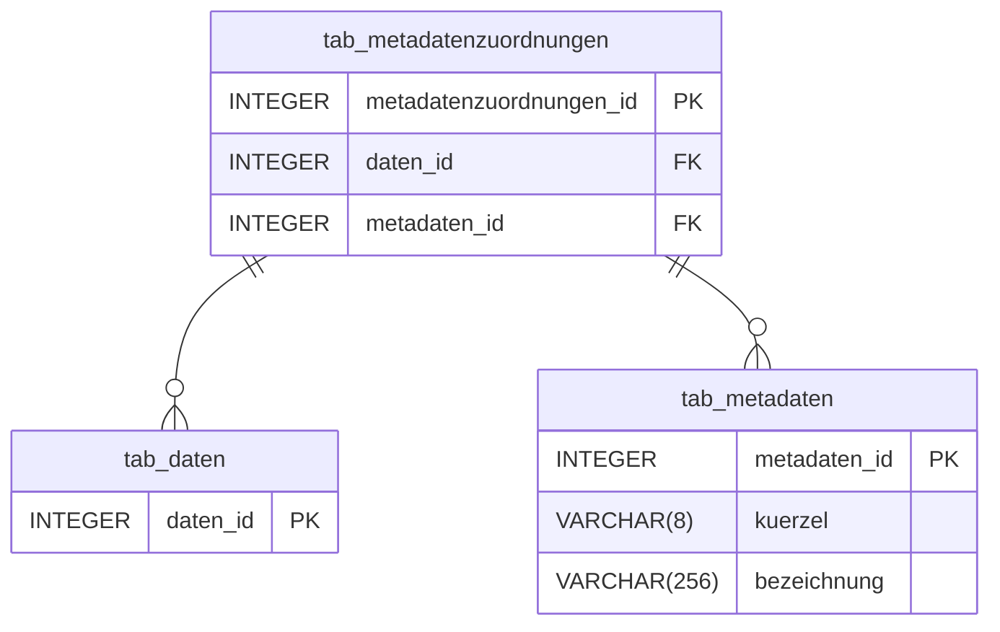
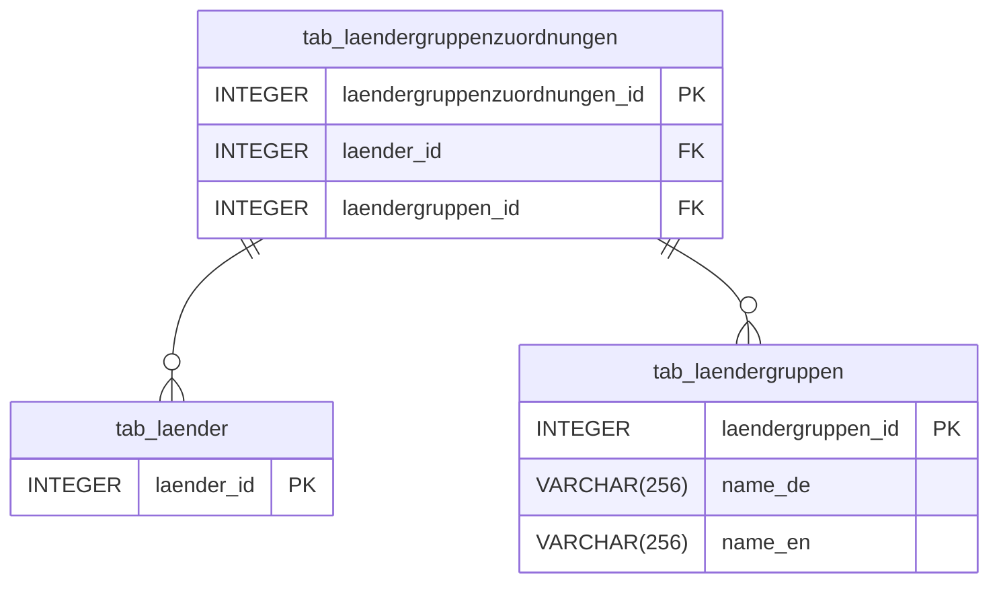
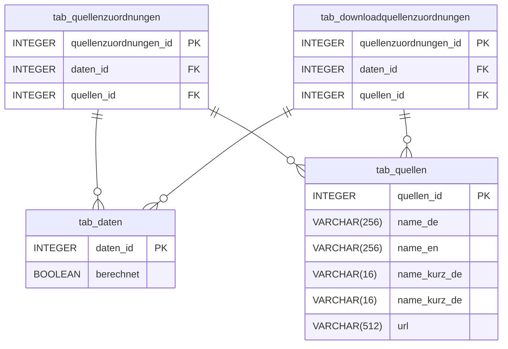
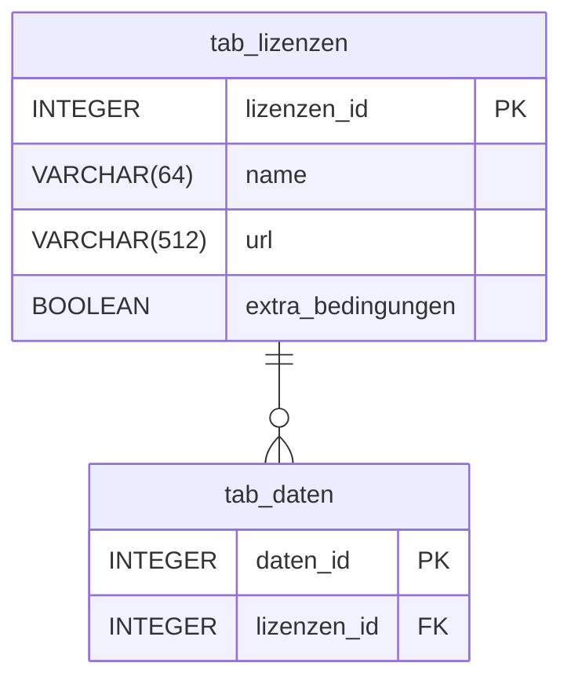
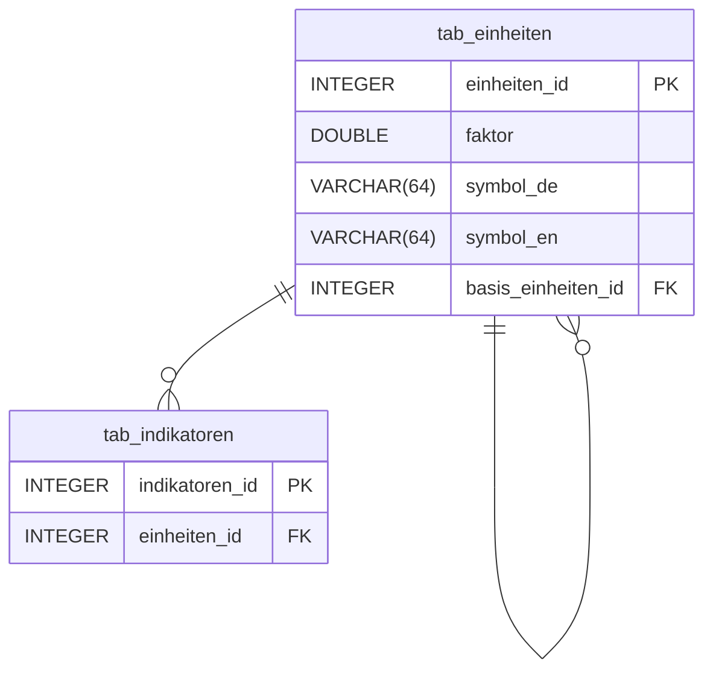
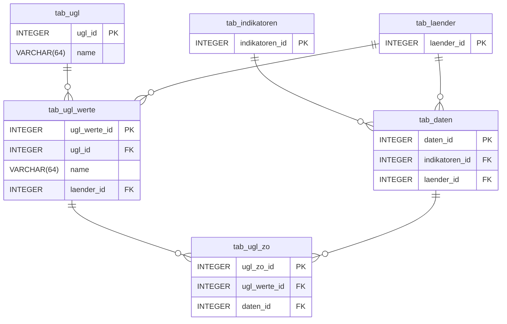

## Inhaltliche Features

### Metadaten

Die Datenbank ermöglicht die flexible Zuordnung von Metadaten zu einzelnen Datenpunkten. Metadaten dienen hier als zusätzliche Informationen, die den Kontext, die Qualität oder die Besonderheiten eines statistischen Werts beschreiben – etwa methodische Hinweise, Fußnoten oder spezifische Anmerkungen zur Datenerhebung.

### Ländergruppen

Ländergruppen ermöglichen die logische Gruppierung von Ländern nach politischen, wirtschaftlichen oder geografischen Kriterien (z.B. EU, OECD, G7). Dies vereinfacht Abfragen und Analysen, die sich auf bestimmte Länderblöcke beziehen.

### Quellen

Die Datenbank verwaltet Quellenangaben für jeden Datenpunkt einzeln, um auch Indikatoren mit gemischten Quellen unterstützen zu können. Es wird auch erfasst, ob ein Datenpunkt berechnet wurde. Weil berechnete Datenpunkte aus mehreren Quellen stammen können, kann jedem Datenpunkt eine beliege Menge an Quellen zugeordnet werden. Außerdem wird unterschieden zwischen _Quellen_, aus denen die Daten ursprünglich stammen und _Download-Quellen_, aus welchen die Daten geladen wurden.

### Lizenzen

Jedem Datenpunkt ist eine Lizenz zugeordnet. Die Lizenz gibt an, wie der Datenpunkt verwendet werden darf. Die Spalte `extra_bedingungen` gibt an, ob weitere Bedingungen bei der Verwendung des Datenpunktes zu beachten sind.

### Einheiten

Jeder Indikator besitzt eine Einheit. Einheiten lassen sich durch einen Faktor und Angabe der jeweiligen Basiseinheit in einander umrechnen (z.B. m² in km²).

### Untergliederungen (ugl)

